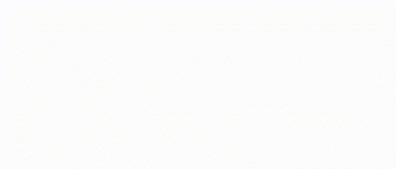

 

  

###

 

  I'm Vanessa Borges — a curious developer who loves clean code, cats 🐾, and plants 🌱.  
   
  Here, you'll find a bit of everything I grow: code, ideas, and side projects.

###

 

  📦 Projects I’m nurturing at the moment: 
  - 🌿 Frontend garden: React, Bootstrap 
  - 🐈 Backend den: Firebase, Node.js 
  - 🧠 Experiments corner: AI, NLP

###

<h1 align="center">🌿 GitHub Stats 🌿</h1>

  
  

###

<h2 align="center">🐾 Cat-approved Tools 🐾</h2>

  
  
  
  
  
  
  
  
  
  
  
  
  
  
  
  
  
  
  
  
  
  
  
  
  
  
  
  
  
  
  
  
  
  
  
  
  
  
  

###

  

 

###

<h2 align="center">📮 Where to find me 📮</h2>

  
  

✉️ vanessa_borges123@outlook.com

###

 

<picture>
  <source media="(prefers-color-scheme: dark)" srcset="https://raw.githubusercontent.com/vborgex/vborgex/output/pacman-contribution-graph-dark.svg">
  <source media="(prefers-color-scheme: light)" srcset="https://raw.githubusercontent.com/vborgex/vborgex/output/pacman-contribution-graph.svg">
  
</picture>

###

  In the silence of whitespace, 
  ideas bloom. 🌿  
  <small><i>See you on the next commit — Vanessa 🖤</i></small>

###
